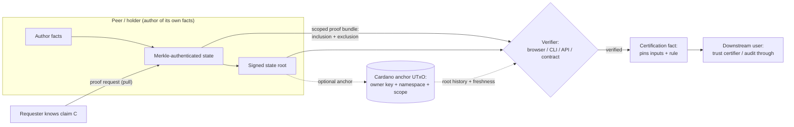

# Peer Proof Protocols

Research and specifications for peer-only Merkle proof protocols.

## What is this

Peer Proof Protocols (PPP) is a spec-driven research proposal for applications
where each peer authors its own Merkle-authenticated state, exchanges scoped
proof bundles, and can promote verified bundles into reusable certified facts.

The value proposition is independent verification without turning one registry,
platform, or oracle into the owner of everyone else's truth. PPP is useful when
a verifier needs to know more than "Alice signed this message once" — for
example whether a known claim is still supported by Alice's current committed
state, or whether Alice can prove that no relevant revocation, dispute, hold, or
supersession exists in a declared scope, without handing over her full database.

This repository is a research program, not a finished product. Its outputs are a
published proposal, protocol concepts and patterns, candidate analyses, and
Spec Kit feature specifications. There is no application code here yet; the
deliverable is the documentation site under `docs/` and the specs under
`specs/`.

## Architecture

PPP turns peer-owned state into portable, selectively disclosed, independently
verifiable evidence. Each peer commits to its own state, discloses only the
relevant slice on request, and a verifier checks that slice locally against
signed or anchored roots. Verified bundles can be promoted into certification
facts; a public chain may anchor roots for ordering and freshness without
becoming the source of semantic truth.



The infrastructure is layered: off-chain peers hold facts and proofs, public
infrastructure anchors roots and ordering, and verifiers check disclosed slices
against those roots. See
[Infrastructure Overview](docs/infrastructure/index.md) for the full layer map.

## Quickstart

Start from the published proposal and follow the suggested reading order:

- Overview and reading guide:
  <https://lambdasistemi.github.io/peer-proof-protocols/>
- Value proposition (business and trust argument):
  <https://lambdasistemi.github.io/peer-proof-protocols/proposal/value-proposition/>
- Protocol research pipeline (concrete targets):
  <https://lambdasistemi.github.io/peer-proof-protocols/protocols/>
- Infrastructure overview (off-chain bundles to on-chain anchors):
  <https://lambdasistemi.github.io/peer-proof-protocols/infrastructure/>

To read the same content from a local checkout, see
[Development](#development) below.

## Usage

### Research scope

In scope:

- peer-owned facts and per-peer roots
- inclusion, exclusion, completeness, freshness, and revocation semantics
- portable proof bundles exchanged between peers and verifiers
- claim authoring, endorsement, scoring, and proof-request flows
- composition of verified bundles into higher-order certified facts
- witness or publication layers that stay narrow and non-authoritative
- protocol evaluation, specifications, verifier rules, and infrastructure
  sketches

Out of scope:

- centralized oracle products
- SaaS trust overlays and registry-style applications
- protocols where detached signatures are already sufficient
- official conformance, accreditation, title-transfer, or compliance authority
  unless a separate governance path is explicit
- polished product UX before the protocol and trust model are clear

### Candidate families

The current candidate set is classified in
[docs/candidates/index.md](docs/candidates/index.md):

- standards-backed protocols: `GS1 EPCIS`, `DCSA Track and Trace`,
  `DCSA Bill of Lading`, `Peppol Post-Award`, `Peppol Pre-Award`,
  `SWIFT Documentary Credits`, `in-toto`, `W3C VC Status Lists`, `OpenID4VC`,
  `Hyperledger AnonCreds`, `Hyperledger Aries`, `Cardano Governance`
- protocol families: `Compliance Audit-Signoff`, `Dispute Resolution`,
  `Independent Journalism`
- internal sketches: `Software Provenance`, `Milestone Settlement`,
  `Custody Handoff`, `Credential Lifecycle`

### Spec Kit workflow

This repo uses Spec Kit for spec-driven development:

1. Establish or amend the constitution.
2. Write a feature specification.
3. Produce a plan and supporting research.
4. Generate tasks.
5. Implement only after the protocol and verification model are specified.

Project governance lives in [`.specify/memory/constitution.md`](.specify/memory/constitution.md).

Active peer-only feature specs:

- [`specs/002-gs1-epcis-peer-traceability/`](specs/002-gs1-epcis-peer-traceability/)
- [`specs/003-in-toto-peer-provenance/`](specs/003-in-toto-peer-provenance/)

The earlier [`specs/001-github-approval-receipts/`](specs/001-github-approval-receipts/)
work is kept as historical context for the oracle/registry direction that this
repository moved away from.

## Documentation

- Published site (GitHub Pages):
  <https://lambdasistemi.github.io/peer-proof-protocols/>
- Local source layout:
  - `docs/proposal/`: value proposition and research method
  - `docs/concepts/`: proof and trust model concepts
  - `docs/patterns/`: reusable protocol patterns
  - `docs/protocols/`: research pipeline and blueprints
  - `docs/candidates/`: candidate protocol analyses and sketches
  - `docs/infrastructure/`: infrastructure map
  - `docs/worksheets/`: evaluation worksheet

For AI agents, start at [AGENTS.md](AGENTS.md); activatable procedures live under
[`skills/`](skills/).

## Development

The site is built with MkDocs using the shared toolchain from
[`paolino/dev-assets`](https://github.com/paolino/dev-assets); there is no
local flake or package manifest in this repository.

Serve the docs locally with live reload:

```bash
nix develop github:paolino/dev-assets?dir=mkdocs --quiet -c mkdocs serve
```

Build the site exactly as CI does (strict mode fails on warnings and broken
links):

```bash
nix develop github:paolino/dev-assets?dir=mkdocs --quiet -c mkdocs build --strict
```

Pull request previews are deployed to:

```text
https://preview.dev.plutimus.com/lambdasistemi/peer-proof-protocols/pr-PR_NUMBER/
```

## License

No license file is present in this repository; all rights are reserved by the
authors unless a `LICENSE` file is added.
